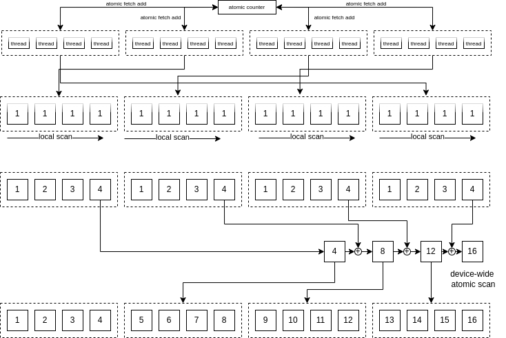

# Sycl(DPC++/OneAPI) Demo: Scan

## Require

```sh
$ . /opt/intel/oneapi/setvars.sh
```

## Compile

```sh
$ mkdir build
$ cd build
$ cmake ..
$ make
```

## Run

```sh
 ❯ ./src/atomic_scan 1024
[100%] Built target atomic_scan
Running on device: Intel(R) UHD Graphics 750 [0x4c8a]
kernel execution time without submission: 1462.47 ms
kernel execution time without submission: 2.7351 GB/s
num_items: 1073741824
1. device. 2510.89 ms
2. host. 300.694 ms
```

## Algorithm

1. Each thread-group calculates its group-id and global-thread-id dynamically using the atomic counter.
2. Each thread loads data at global-thread-id as an index and calculates local scan.
3. A worker thread in each thread-group calculates the global prefix-sum of partial sums.
4. Each thread calculates the global scan by the result of step-3 and writes it to the device memory.



